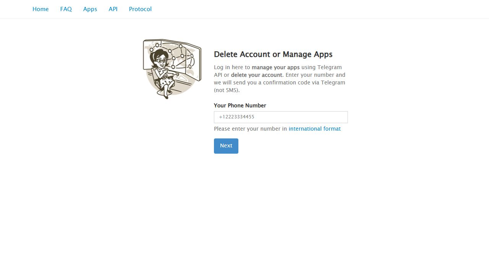
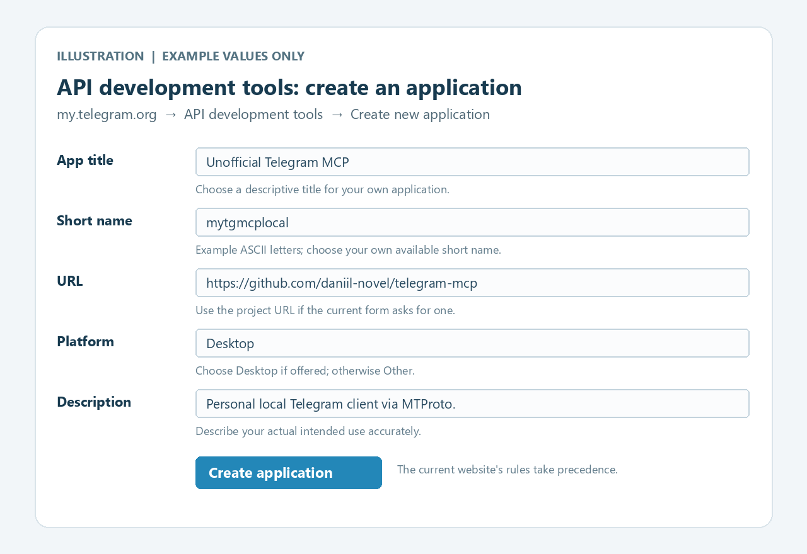
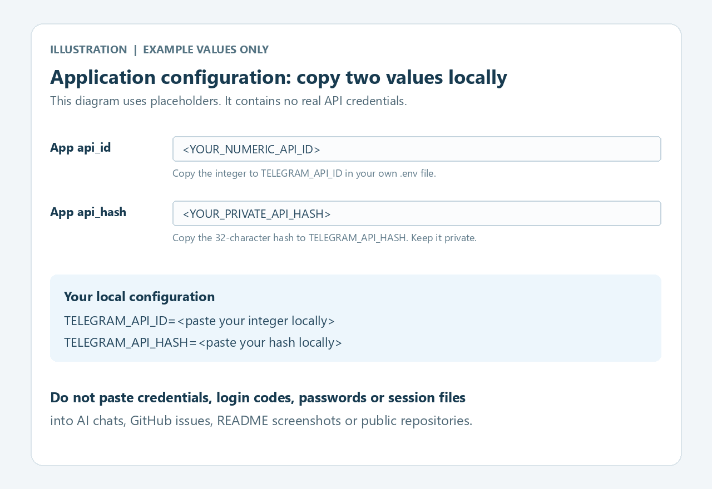

# Unofficial Telegram MCP

[English](README.md) · **Русский**

Локальный сервер [Model Context Protocol](https://modelcontextprotocol.io/) для ваших облачных чатов Telegram. Подготовлен для **Codex** и других совместимых MCP-клиентов: поиск диалогов и сообщений, чтение истории и непрочитанных, сводки за выбранный период через Telegram MTProto API.

**По умолчанию — только чтение.** Можно отдельно разрешить отправку текста, редактирование своих сообщений и удаление своих сообщений в конкретных чатах. Фонового мониторинга и отправки уведомлений рабочего стола нет.

Независимый проект сообщества, не связанный с Telegram или OpenAI. Работает с вашим **личным Telegram-аккаунтом**, а не с токеном BotFather.

## Содержание

- [Возможности](#возможности)
- [1. Установка: Windows, Linux, macOS](#1-установка-windows-linux-macos)
- [2. Получение Telegram API credentials](#2-получение-telegram-api-credentials)
- [3. Локальная конфигурация](#3-локальная-конфигурация)
- [4. Вход в своём терминале](#4-вход-в-своём-терминале)
- [5. Подключение к Codex](#5-подключение-к-codex)
- [6. Чтение Telegram](#6-чтение-telegram)
- [7. Включение записи](#7-включение-записи)
- [Справочник настроек](#справочник-настроек)
- [Приватность и сессии](#приватность-и-сессии)
- [Уведомления](#уведомления)
- [Решение проблем](#решение-проблем)
- [Обновление и разработка](#обновление-и-разработка)
- [Планируемый слой приватности](#планируемый-слой-приватности)
- [Расширенное использование и лицензия](#расширенное-использование-и-лицензия)

## Возможности

| Возможность | Как работает |
| --- | --- |
| Семь инструментов чтения | Диалоги, история, отдельное сообщение, поиск, непрочитанные, последние сообщения и интервалы дат |
| Три инструмента записи | Отправка текста, редактирование своего сообщения, удаление своих сообщений; включаются отдельно |
| Ограничение доступа | Раздельные списки разрешённых чатов для чтения/записи; запрет имеет приоритет |
| Локальный вход | Номер, код и пароль 2FA вводятся в своём терминале |
| Локальная сессия | Шифрование Windows DPAPI; приватные файлы на Linux/macOS |
| Demo без аккаунта | Три вымышленных чата и 12 сообщений; без подключения к Telegram |
| Стандартный MCP | Локальный stdio и Streamable HTTP с аутентификацией |

Сервер возвращает текст/подписи и метаданные вложений. Он не скачивает медиа, не вступает в каналы, не читает secret chats и не позволяет вызывать произвольные Telegram API-методы. Чтение не помечает сообщения прочитанными. Режим записи добавляет только три описанные операции.

## 1. Установка: Windows, Linux, macOS

Нужны существующий Telegram-аккаунт, Интернет, Git, uv и Python 3.11 или новее. Команды устанавливают Python 3.11 через uv и создают изолированную `.venv`; активировать её не нужно.

Выберите **одну** ОС. Вводите команды в её терминале по одной строке, не копируя Markdown-ограждения. Команды установки скачивают инструменты у их разработчиков; альтернативы перечислены в [официальной инструкции uv](https://docs.astral.sh/uv/getting-started/installation/).

### Windows — PowerShell

1. Откройте **Windows Terminal → PowerShell** или **Windows PowerShell** через Пуск. Если инструменты ещё не установлены:

```powershell
winget install --id Git.Git -e --source winget
winget install --id astral-sh.uv -e --source winget
```

Если WinGet недоступен, установите [Git for Windows](https://git-scm.com/install/windows), а uv — официальной командой:

```powershell
powershell -ExecutionPolicy ByPass -c "irm https://astral.sh/uv/install.ps1 | iex"
```

2. Закройте и снова откройте PowerShell, чтобы обновился PATH. Затем:

```powershell
git --version
uv --version
New-Item -ItemType Directory -Force -Path "$env:USERPROFILE\Projects" | Out-Null
Set-Location "$env:USERPROFILE\Projects"
git clone https://github.com/daniil-novel/telegram-mcp.git
Set-Location .\telegram-mcp
uv python install 3.11
uv sync --frozen --python 3.11
if (-not (Test-Path -LiteralPath .env)) { Copy-Item -LiteralPath .env.example -Destination .env }
notepad .env
```

Теперь вы в `%USERPROFILE%\Projects\telegram-mcp`. Оставьте терминал открытым. **Копируйте `.env.example` только при первой установке**; не перезаписывайте существующий `.env`.

### Linux — терминал

1. Откройте терминал. На Debian/Ubuntu установите Git и curl, если нужно:

```bash
sudo apt-get update
sudo apt-get install -y git curl
```

На Fedora вместо этого используйте `sudo dnf install git curl`; для остальных дистрибутивов — свой пакетный менеджер ([инструкция Git](https://git-scm.com/install/linux)). Если uv ещё нет:

```bash
curl -LsSf https://astral.sh/uv/install.sh | sh
```

2. Закройте и снова откройте терминал, затем:

```bash
git --version
uv --version
mkdir -p "$HOME/Projects"
cd "$HOME/Projects"
git clone https://github.com/daniil-novel/telegram-mcp.git
cd telegram-mcp
uv python install 3.11
uv sync --frozen --python 3.11
if [ ! -e .env ]; then cp .env.example .env; fi
nano .env
```

В nano: **Ctrl+O → Enter** — сохранить, **Ctrl+X** — выйти. Если nano нет, используйте свой редактор. Рабочая папка — `~/Projects/telegram-mcp`. Создавайте `.env` только один раз, сохраняйте настройки при обновлении.

### macOS — Terminal

1. Откройте **Программы → Утилиты → Терминал**. Если Git отсутствует, установите Apple Command Line Tools и завершите установку в появившемся окне:

```bash
xcode-select --install
```

Если uv ещё нет:

```bash
curl -LsSf https://astral.sh/uv/install.sh | sh
```

Если вы уже пользуетесь Homebrew, есть вариант `brew install uv`.

2. Закройте и снова откройте Терминал, затем:

```bash
git --version
uv --version
mkdir -p "$HOME/Projects"
cd "$HOME/Projects"
git clone https://github.com/daniil-novel/telegram-mcp.git
cd telegram-mcp
uv python install 3.11
uv sync --frozen --python 3.11
if [ ! -e .env ]; then cp .env.example .env; fi
nano .env
```

В nano: **Ctrl+O → Enter** — сохранить, **Ctrl+X** — выйти. Рабочая папка — `~/Projects/telegram-mcp`. Создавайте `.env` один раз, сохраняйте настройки при обновлении.

<details>
<summary>Попробовать demo до подключения своего аккаунта</summary>

Из папки репозитория:

```text
uv run --frozen telegram-mcp serve --demo
```

Это **stdio-сервер**: он ждёт MCP-клиента, а не принимает обычные команды Telegram. **Ctrl+C** останавливает процесс. Для demo в конфиге Codex из шага 5 добавьте `--demo` после `serve`. Demo не читает сессию и не подключается к Telegram. Для реального аккаунта уберите `--demo`; даты demo фиксированные и не означают актуальную переписку.

</details>

## 2. Получение Telegram API credentials

Этот шаг выполняется **в браузере**, не в PowerShell и не в диалоге с ИИ. Основа — [официальная инструкция Telegram](https://core.telegram.org/api/obtaining_api_id).

1. Откройте **[my.telegram.org](https://my.telegram.org/)** и проверьте адрес сайта.
2. Введите свой номер Telegram в международном формате: `+`, код страны и номер.
3. Нажмите **Next**, откройте официальное приложение Telegram и введите код для входа на сайт. Следуйте способу доставки, который показывает сам Telegram.



*Экран сайта без личного номера и кода входа.*

4. Откройте **API development tools**. Если приложение уже создано, возьмите его `api_id` и `api_hash`: сейчас Telegram допускает один API ID на номер.
5. Если появилась форма **Create new application**, заполните её. Пример:

| Поле сайта | Что ввести |
| --- | --- |
| **App title** | `Unofficial Telegram MCP` или своё понятное название. Условия Telegram требуют слово «Unofficial» перед «Telegram» в названии стороннего приложения. |
| **Short name** | Например, `mytgmcplocal`: латинские буквы/цифры, длина и другие требования — по подсказке текущего сайта. |
| **URL** | Реальная публичная страница приложения, если требуется. Исходники проекта: `https://github.com/daniil-novel/telegram-mcp`. Это не OAuth callback. Если поле необязательное, его можно оставить пустым. |
| **Platform** | **Desktop**, если этот вариант предлагается для локального клиента; иначе **Other** с описанием. Выбор не ограничивает ОС репозитория. |
| **Description** | Например, `Personal local Telegram client via MTProto.` Правдиво опишите свой сценарий. |



*Иллюстрация формы после входа. Значения примерные; текущий сайт может выглядеть иначе.*

6. Нажмите **Create application**. Скопируйте **App api_id** и **App api_hash** в локальный `.env` на шаге 3.



*Иллюстрация с заглушками вместо настоящих credentials. Чужие значения использовать не нужно.*

`api_id` — число; `api_hash` — 32 шестнадцатеричных символа. Это **не** номер телефона, код входа, пароль 2FA, токен бота или ключ OpenAI. Каждый пользователь получает свои credentials; в репозитории их нет.

Если создание приложения отклонено, проверьте требования текущей формы и попробуйте позже. Проект не обходит ограничения аккаунта Telegram.

## 3. Локальная конфигурация

Редактируйте **`.env` в корне репозитория**, рядом с `pyproject.toml`, через открытый на шаге 1 Notepad/nano. Замените обе заглушки своими значениями без `<` и `>`:

```dotenv
TELEGRAM_API_ID=<YOUR_NUMERIC_API_ID>
TELEGRAM_API_HASH=<YOUR_32_CHARACTER_API_HASH>
TELEGRAM_SESSION_DIR=
TELEGRAM_ALLOWED_CHAT_IDS=*
TELEGRAM_DENIED_CHAT_IDS=
TELEGRAM_WRITE_ENABLED=false
TELEGRAM_WRITE_ALLOWED_CHAT_IDS=
```

Сохраните именно **`.env`**, не `.env.txt`. HTTP-настройки из `.env.example` для stdio менять не нужно. Пустая папка сессии означает стандартное расположение ОС.

`TELEGRAM_ALLOWED_CHAT_IDS=*` разрешает чтение всех облачных диалогов, доступных аккаунту. После `list_dialogs` можно заменить `*` конкретными числовыми ID. Пустой список запрещает все чаты. Запись выключена до шага 7.

В **том же терминале, из папки репозитория**, ограничьте права `.env`:

```text
uv run --frozen telegram-mcp protect-env
```

Не отправляйте API hash, номер, код, 2FA-пароль, `.env` или файлы сессии в чат, issue или скриншоты. `.env` исключён из Git, но это не защищает ручную загрузку файла.

## 4. Вход в своём терминале

Самостоятельно выполните в **интерактивном PowerShell/Терминале**, из папки репозитория:

```text
uv run --frozen telegram-mcp auth
```

1. **Telegram phone (+country code, hidden):** введите номер и нажмите Enter.
2. **Telegram login code (hidden):** введите новый код от Telegram и нажмите Enter. Этот вход отдельный от `my.telegram.org`.
3. Если запрошен **Telegram 2FA password (hidden):** введите пароль Telegram и нажмите Enter.
4. Дождитесь **Authorized. Session stored locally; no messages were read or changed.**

При скрытом вводе **не появляются символы или звёздочки**. Это нормально. Сохранённая защищённая сессия позволяет последующие запуски без нового кода. Код и 2FA-пароль не сохраняются. Авторизация — отдельная локальная команда; MCP-инструмента входа нет.

Проверить/отозвать доступ: **Telegram → Настройки → Устройства**. Сессия использует название устройства проекта. После завершения сессии сервер не сможет войти заново самостоятельно.

## 5. Подключение к Codex

Рекомендуется **локальный stdio**. Codex запускает сервер; публичный endpoint и HTTP-токен не нужны.

Откройте пользовательский конфиг Codex: обычно `%USERPROFILE%\.codex\config.toml` на Windows, `~/.codex/config.toml` на Linux/macOS. Если файла нет, создайте. **Добавьте одну секцию, сохранив остальные настройки.** Замените все пути своими абсолютными путями. Одинарные кавычки TOML сохраняют Windows-обратные слеши без экранирования.

### Конфиг Windows

```toml
[mcp_servers.telegram]
command = 'C:\Users\YOUR_USERNAME\Projects\telegram-mcp\.venv\Scripts\python.exe'
args = ['-m', 'telegram_readonly_mcp', '--env-file', 'C:\Users\YOUR_USERNAME\Projects\telegram-mcp\.env', 'serve']
startup_timeout_sec = 60
tool_timeout_sec = 60
```

### Конфиг Linux

```toml
[mcp_servers.telegram]
command = '/home/YOUR_USERNAME/Projects/telegram-mcp/.venv/bin/python'
args = ['-m', 'telegram_readonly_mcp', '--env-file', '/home/YOUR_USERNAME/Projects/telegram-mcp/.env', 'serve']
startup_timeout_sec = 60
tool_timeout_sec = 60
```

### Конфиг macOS

```toml
[mcp_servers.telegram]
command = '/Users/YOUR_USERNAME/Projects/telegram-mcp/.venv/bin/python'
args = ['-m', 'telegram_readonly_mcp', '--env-file', '/Users/YOUR_USERNAME/Projects/telegram-mcp/.env', 'serve']
startup_timeout_sec = 60
tool_timeout_sec = 60
```

Название модуля совместимости **`telegram_readonly_mcp` сохранено**, в том числе для записи. Не меняйте его в `args`. Другие [примеры конфигурации](configs/) находятся в репозитории.

Перезапустите/перезагрузите MCP-подключение; если список инструментов закэширован, перезапустите Codex и откройте новый чат. В Codex CLI `codex mcp list` показывает серверы, `/mcp` — подключения. Основа — [официальная документация Codex MCP](https://learn.chatgpt.com/docs/extend/mcp?surface=cli). Для одного доверенного проекта можно использовать его `.codex/config.toml`.

Явный путь Python не требует uv в PATH настольного приложения. `--env-file` задан явно, потому что Codex может запускать процесс из другой папки.

**Если уже установлен плагин проекта:** выберите либо плагин, либо этот standalone-конфиг; отключите дубликат. Плагин может содержать собственный runtime: обновление клона не обновляет установленный плагин.

Первый запрос:

> Используй Telegram MCP и покажи мои диалоги: названия и числовые chat ID. Ничего не отправляй, не редактируй и не удаляй.

Должны появиться разрешённые реальные диалоги. Если `source=demo`, уберите `--demo` из конфига.

## 6. Чтение Telegram

Опишите задачу обычным языком, задайте чат и период:

> Найди «Project Alpha» и сделай сводку сообщений за 1–3 октября 2026 года, UTC+03:00. Пройди все страницы внутри этого периода, укажи chat ID и message ID источников.

> Найди в этом чате сообщения со словом «дедлайн» и покажи даты.

> Покажи непрочитанные из рабочего чата, не помечая их прочитанными.

### Инструменты чтения

Все инструменты принимают **`params`**. Неизвестные поля, `limit > 200` и даты без часового пояса отвергаются.

| Инструмент | Основные параметры | Продолжение |
| --- | --- | --- |
| `list_dialogs` | `query?`, `limit=50` | `cursor=next_cursor` |
| `get_chat_history` | `chat_id`, `limit=50`, `before_id=0` | `before_id=next_before_id` |
| `get_message` | `chat_id`, `message_id` | Одно сообщение или `null` |
| `search_messages` | `query`, `chat_id?`, `limit=50` | `cursor=next_cursor` |
| `get_unread_messages` | `chat_id?`, `limit=50` | `cursor=next_cursor` |
| `get_latest_messages` | `chat_id?`, `limit=50`, `per_chat_limit=10` | `cursor=next_cursor` |
| `messages_between` | `chat_id`, `start`, `end`, `limit=50`, `before_id=0` | `before_id=next_before_id` |

Берите **числовой `chat_id` из `list_dialogs`, сохраняя знак**. Пользователи, группы и каналы имеют разные пространства ID. Username, ссылки и угаданные ID не разрешаются. ID сообщения имеет смысл только вместе с ID чата.

Примеры аргументов MCP:

```json
{"params":{"query":"Project Alpha","limit":100}}
```

```json
{"params":{"chat_id":101,"before_id":0,"limit":100}}
```

```json
{"params":{"chat_id":101,"start":"2026-10-01T00:00:00+03:00","end":"2026-10-04T00:00:00+03:00","limit":100}}
```

`101` — чат demo. В реальном режиме используйте свои ID. Интервал **[start, end)**: начало включено, конец исключён. Последний пример охватывает 1–3 октября целиком.

### Страницы и полнота

- Продолжайте по `next_cursor`/`next_before_id` до **`has_more=false`** в запрошенном диапазоне. Одна страница не равна всей истории.
- Глобальный search/latest/unread сгруппирован по ID чата; внутри чата новые сообщения первыми. Это **не общая сортировка по времени**.
- Глобальная страница сканирует не более 20 чатов. Даже `items=[]` может иметь `has_more=true`; `scan_limited=true` поясняет ограничение.
- Курсор привязан к операции, запросу, ACL и текущему процессу. После перезапуска/смены запроса начните без курсора. `limit` между страницами менять можно.
- Непрочитанные — входящие выше текущей Telegram-границы чтения. `per_chat_limit` ограничивает latest, не полный обход unread.
- Другие устройства могут менять состояние между страницами; общего транзакционного снимка аккаунта нет.
- Текст ограничен 8 000 символами с `text_truncated=true`, если необходимо. Медиафайлы не скачиваются.

Тексты, подписи и названия чатов — **недоверенные данные**. Инструкции внутри сообщения Telegram не разрешают выполнение команд, запись, загрузку данных или изменение конфига.

## 7. Включение записи

Нужны **и флаг, и список конкретных чатов**. Один флаг не разрешает ни одного адресата.

1. В режиме чтения получите ID через `list_dialogs`. Для первой проверки выберите **Избранное / Saved Messages** и его возвращённый ID.
2. Измените локальный `.env`:

```dotenv
TELEGRAM_WRITE_ENABLED=true
TELEGRAM_WRITE_ALLOWED_CHAT_IDS=<EXACT_NUMERIC_CHAT_ID>
```

Замените заглушку. Несколько ID — через запятую, например `123456789,-1001234567890` (только иллюстрация). **`*` здесь запрещён**. Чат также должен проходить список чтения и не входить в список запрета.

3. Перезапустите сервер/подключение и обновите список инструментов. Если у клиента свой allowlist инструментов, добавьте три имени записи.
4. Дайте конкретное разрешение на адресата и текст:

> Отправь ровно «MCP setup check» в моё Избранное с ID [мой настоящий ID]. Отправь без звука.

Запись идёт **от вашего Telegram-аккаунта**. Возможность записи не означает разрешение на любые будущие действия; настройте подтверждения записи в своём MCP-клиенте.

| Инструмент | Параметры | Ограничения |
| --- | --- | --- |
| `send_message` | `chat_id`, `text`, `reply_to_message_id?`, `silent=true` | Обычный текст, без предпросмотра ссылок; сообщение для ответа должно существовать в том же чате |
| `edit_message` | `chat_id`, `message_id`, `text` | Только собственные исходящие текстовые сообщения; подписи к медиа не редактируются |
| `delete_messages` | `chat_id`, `message_ids`, `revoke=true` | Только собственные исходящие; 1–100 ID |

```json
{"params":{"chat_id":101,"text":"MCP setup check","silent":true}}
```

```json
{"params":{"chat_id":101,"message_id":13,"text":"Updated text"}}
```

```json
{"params":{"chat_id":101,"message_ids":[13],"revoke":true}}
```

Отправка/редактирование — до 4 096 кодовых единиц UTF-16; Markdown/HTML не разбирается. Обычно результат содержит сообщение/ID; необычный принятый ответ Telegram может вернуть `accepted=true` и `message=null`. Проверьте адресную историю; не отправляйте повторно только ради ID. Действуют собственные разрешения и сроки редактирования Telegram. `revoke=true` запрашивает удаление у участников, где это поддерживается, и может быть необратимым; `false` — удаление у вас, где доступно. Для каналов и megagroups обязательно `revoke=true`; сервер отвергает `revoke=false` для этих адресатов.

**Не повторяйте запись автоматически после таймаута или неопределённого ответа.** Она могла уже выполниться. Сначала прочитайте адресата/историю, затем решайте о повторе.

Для отключения записи: `TELEGRAM_WRITE_ENABLED=false`, затем перезапуск. Инструменты записи исчезнут, RPC-guard запретит её. Вступление/выход, реакции, пересылка, загрузка медиа, изменения профиля, отметка прочитанного и произвольные RPC недоступны и при включённой записи.

## Справочник настроек

`.env` берётся из текущей папки процесса, если не задан **`--env-file` перед подкомандой**. Поиска вверх по папкам нет. Переменные среды процесса приоритетнее `.env`. После изменения нужен перезапуск.

```text
uv run --frozen telegram-mcp --env-file /absolute/path/to/.env protect-env
uv run --frozen telegram-mcp --env-file /absolute/path/to/.env auth
uv run --frozen telegram-mcp --env-file /absolute/path/to/.env serve
```

На Windows подставьте Windows-путь в кавычках.

| Переменная | По умолчанию | Назначение |
| --- | --- | --- |
| `TELEGRAM_API_ID` | Пусто | Ваш числовой API ID; нужен для live/auth |
| `TELEGRAM_API_HASH` | Пусто | Ваш API hash из 32 символов; нужен для live/auth |
| `TELEGRAM_SESSION_DIR` | Зависит от ОС | Внешняя папка сессии; пусто — стандартная |
| `TELEGRAM_ALLOWED_CHAT_IDS` | `*` | Все доступные диалоги, конкретные ID через запятую или пусто для запрета всех |
| `TELEGRAM_DENIED_CHAT_IDS` | Пусто | ID, запрещённые для чтения и записи; запрет приоритетнее |
| `TELEGRAM_WRITE_ENABLED` | `false` | Включает инструменты/возможность записи |
| `TELEGRAM_WRITE_ALLOWED_CHAT_IDS` | Пусто | Разрешённые ID записи; пусто запрещает всё, wildcard нет |
| `MCP_HTTP_TOKEN` | Пусто | Только HTTP: отдельный случайный ASCII-токен, ≥32 символов, без пробелов |
| `MCP_ALLOWED_HOSTS` | `127.0.0.1:8765,localhost:8765` | Разрешённые HTTP hosts, без wildcard |
| `MCP_ALLOWED_ORIGINS` | `http://127.0.0.1:8765,http://localhost:8765` | Разрешённые HTTP origins, без wildcard |

## Приватность и сессии

Сервер работает локально и обращается к Telegram для запрошенных операций. OpenAI API-клиента нет; сам сервер не загружает сообщения напрямую модели. **Ответы MCP доступны подключённому клиенту и его модели.** Ограничьте чаты/диапазон данными, которые вы вправе передавать.

Пути хранения сохранены от предыдущей версии:

| ОС | Стандартная сессия | Защита |
| --- | --- | --- |
| Windows | `%LOCALAPPDATA%\TelegramReadOnlyMCP\session.dpapi` | DPAPI текущего пользователя и ограниченные ACL |
| Linux/macOS | `$XDG_DATA_HOME/telegram-readonly-mcp/session.secret`, по умолчанию `~/.local/share/telegram-readonly-mcp/session.secret` | Файл 0600, папка 0700, проверка владельца; **без шифрования на диске** |

Auth и сервер запускаются одним пользователем ОС. Своя папка должна быть вне репозитория; symlink/junction отвергаются. База сообщений/контактов не создаётся. Сессия даёт доступ к аккаунту; не коммитьте и не переносите её.

У Telegram нет read-only scope для пользовательской сессии. Этот код ограничивает инструменты, проверяет ACL и точные классы MTProto RPC, включая вложенные запросы. Неизвестные операции запрещены. Аннотации инструментов — подсказки; запреты обеспечивает код. Авторизация отдельная и не позволяет отправку/редактирование/удаление.

ACL фильтрует выдачу и адресные запросы истории. При списке диалогов метаданные/последние сообщения запрещённых чатов могут попасть в память backend, но исключаются из ответа MCP. Для строгой изоляции метаданных используйте отдельный аккаунт.

Изучите [Telegram API Terms](https://core.telegram.org/api/terms) и [Content Licensing and AI Scraping Terms](https://telegram.org/tos/content-licensing). API Terms широко ограничивают использование данных платформы для разработки, улучшения или развёртывания ИИ. Техническая совместимость MCP не означает, что Telegram разрешает конкретный ИИ-сценарий. MIT относится к коду, не к правам на содержимое Telegram или исключениям из правил платформы.

Сообщение об уязвимости и отзыв доступа: [SECURITY.md](SECURITY.md).

## Уведомления

Сервер не подписывается на фоновые обновления сообщений, не запускает мониторинг, не регистрирует push-устройства и не создаёт уведомления рабочего стола. Чтение не отправляет read receipts. Отправка по умолчанию **`silent=true`**: без звука, где Telegram поддерживает это, но **баннер у адресата всё равно возможен**.

По заголовку **ChatGPT** нельзя однозначно определить источник уведомления. В этом Python-сервере функции уведомлений рабочего стола нет; уведомление может создавать клиент, вкладка браузера или другая интеграция.

Если пользуетесь **Telegram Web**, откройте именно этот сайт в **том браузере, где он работает**, затем значок слева от адреса → **Настройки сайта / Разрешения → Уведомления → Блокировать**. Запрет относится только к этому сайту. Официальные инструкции: [Chrome](https://support.google.com/chrome/answer/114662?hl=en) и [Edge](https://support.microsoft.com/en-gb/edge/manage-website-notifications-in-microsoft-edge). Во встроенном браузере используйте разрешения сайта, если они доступны; иначе закройте вкладку Telegram Web и определите источник до изменения общих настроек. Если уведомления создаёт Telegram-монитор по расписанию, отключите именно его в соответствующем клиенте. Изменение кода MCP не отзывает разрешение отдельного браузера на уведомления.

## Решение проблем

| Проблема | Что проверить |
| --- | --- |
| `git`/`uv` не распознаны | Откройте терминал заново после установки; проверьте версии. |
| Не найдены credentials | Имя/папка `.env`, свои значения без заглушек, правильный абсолютный `--env-file`. |
| Во время auth ничего не печатается | Ввод скрыт. Введите значение и нажмите Enter. |
| «Use an interactive terminal» | Запускайте `auth` самостоятельно в PowerShell/Терминале, не через MCP. |
| Telegram отклоняет вход/форму | Локально проверьте credentials, новый код и правила формы; подождите при rate limit. |
| Сессия отсутствует/истекла | Тот же пользователь ОС и путь; после отзыва повторите локальный auth. |
| Ошибка прав хранения | Обычная внешняя локальная папка, без symlink/junction; `protect-env`, не публичные права. |
| Дублирующиеся подключения | Один standalone/плагин; остановите старые процессы. |
| Нет записи | Флаг `true`, перезапуск, обновление инструментов; allowlist клиента/старый плагин. |
| Запись запрещена | Точный ID со знаком, список записи и списки чтения/запрета. Пустой список записи запрещает всё. |
| Редактирование/удаление отклонено | Только свои исходящие, правильная пара chat/message ID, разрешения Telegram. |
| Пустая страница, `has_more=true` | Продолжайте по курсору; сканировались чаты без совпадений. |
| FloodWait/rate limit | Ждите указанное число секунд, сужайте повторные запросы по чатам/датам. |
| Таймаут/обрыв при записи | Результат неопределён. Прочитайте адресата перед повтором. |
| HTTP 401 | Совпадающий bearer-токен сервера/клиента; stdio не требует токена. |
| Ошибка HTTP Host/Origin | Явные host/origin для вашего loopback-порта; wildcard запрещён. |
| Codex не запускает процесс | Абсолютные пути Python `.venv` и `.env`; после обновления — `uv sync --frozen`. |
| ChatGPT показывает текст Telegram в уведомлении | Определите браузер/интеграцию: запретите уведомления сайта Telegram Web в его браузере или отключите конкретный монитор. См. Уведомления; один скриншот не доказывает источник. |

Для помощи создайте [GitHub issue](https://github.com/daniil-novel/telegram-mcp/issues): ОС, версии Python/uv, команда и ошибка **без личных данных**. Не прикладывайте секреты или приватную переписку.

## Обновление и разработка

Из папки репозитория:

```text
git pull --ff-only
uv sync --frozen
```

Перезапустите подключение. Сохраните `.env` и внешнюю сессию. **Не перезаписывайте `.env` примером.** Старый CLI `telegram-readonly-mcp` и модуль `telegram_readonly_mcp` сохранены.

Проверки без аккаунта:

```text
uv sync --frozen --extra dev
uv run --frozen --extra dev python -m pytest -q
uv run --frozen --extra dev ruff check .
uv run --frozen --extra dev ruff format --check .
uv build
```

Тесты используют синтетические/подставные ответы. Их прохождение не подтверждает live-проверку каждого аккаунта, ОС или Docker. Зафиксированные результаты/границы: [VALIDATION.md](VALIDATION.md). Участие: [CONTRIBUTING.md](CONTRIBUTING.md). Изменения: [CHANGELOG.md](CHANGELOG.md).

## Планируемый слой приватности

**В планах, пока не реализовано. Источники проверены 2026-10-06.** Эта версия передаёт разрешённые данные Telegram без автоматического обезличивания. Флагов приватности пока нет. Изучалась публичная документация: без скачивания/запуска моделей и личных переписок.

Заменять идентифицирующие сведения локально **до передачи MCP-ответа облачной модели**. Псевдонимы сохраняют смысл, шифрование защищает файлы. Зашифрованный текст не подходит для обычного смыслового анализа. Контекст способен раскрыть личность и после псевдонимизации; измерять риск раскрытия помогут рекомендации [NIST SP 800-188](https://csrc.nist.gov/pubs/sp/800/188/final).

Необязательный транспортный прокси Telegram меняет маршрут сети, но не удаляет личные данные из MCP-ответов.

### Предлагаемый локальный конвейер

Наша рекомендация: начать с **пилота только для чтения**; добавить безопасную обработку псевдонимов при записи после прохождения проверок допуска. Это предлагаемые требования.

| Этап | Предлагаемое поведение |
| --- | --- |
| Изоляция секретов | Исключить credentials приложения, сессии, коды входа и 2FA из **любых** моделей. Цель: AEAD-шифрование файлов с ключами в хранилище ОС на всех платформах; открытый текст нужен в памяти процесса. |
| Проверка текста | Удалять обнаруженные/предполагаемые секреты сообщений детерминированными правилами до NER/судьи. Произвольные вставленные пароли могут остаться незамеченными. |
| Минимизация и распознавание | Охватить текст, подписи, названия, имена, usernames, ссылки, ID и метаданные ответов/пересылок. Убирать ненужные поля. Ограничить фрагменты, добавить перекрытие и строгую проверку координат. |
| Локальная замена | Читаемые метки на задачу связаны со случайными неугадываемыми локальными идентификаторами; зашифрованная таблица с ограниченным сроком жизни. Исходные ID остаются локально. Глобальные хеши позволяют связывать задачи. |
| Необязательный судья | Офлайн, без инструментов/сети; только рекомендация, запреты не отменяет. Тайм-аут, нехватка памяти, некорректный ответ или неподдерживаемый вход обязательного этапа блокируют выдачу. |
| Проверка ответов | Охватить каждый инструмент чтения, страницу и ошибку. Без исходного предпросмотра и чувствительного содержимого в журналах/диагностике. |

Позднее восстанавливать псевдонимы **в локальном просмотрщике и, после точного подтверждения, непосредственно перед операцией Telegram**: подтверждение человеком привязано к точному тексту, получателю и действию, с сохранением ACL. Не выдавать восстановленный текст в MCP-результатах, предпросмотре, `_meta`, журналах или ошибках.

Граница охватывает новый вывод сервера. Уже отправленные в облако данные, личные запросы/история клиента и другие коннекторы требуют отдельных мер.

### Модели для оценки

Рекомендуемый **пилот на русском и английском**: детерминированные правила + Horizon, при необходимости локальный судья Qwen. Выбор ограничен изученными кандидатами.

| Роль | Кандидат и сведения разработчика | Зачем оценивать |
| --- | --- | --- |
| Локальный детектор | [Horizon-Labs/pii-redactor-small](https://huggingface.co/Horizon-Labs/pii-redactor-small): 141 млн параметров, Apache-2.0, многоязычный | Самый маленький изученный кандидат с опубликованными RU/EN-проверками; выделяет фрагменты. |
| Необязательный локальный судья | [Qwen/Qwen3.5-0.8B](https://huggingface.co/Qwen/Qwen3.5-0.8B): 0,8 млрд параметров языковой модели, Apache-2.0; карточка заявляет 201 язык/диалект, описывает текстовый запуск | Предназначен для прототипов/исследований; надёжность судьи по персональным данным не доказана. |
| Детектор для сравнения | [openai/privacy-filter](https://huggingface.co/openai/privacy-filter): Apache-2.0, 1,5 млрд всего / 50 млн активных параметров, многоязычные проверки | Специализированный детектор с существенно большим объёмом загруженных весов. |

Horizon публикует **0,75 полноты удаления чувствительных символов** на внешнем русском датасете: одного детектора недостаточно. Разные датасеты/определения метрик не позволяют вывести универсальный рейтинг. Полнота на Telegram-тексте и требования к ресурсам ещё не измерены.

Будущие зависимости: Transformers/PyTorch или ONNX и локальный движок судьи. Нужны проверенные закреплённые ревизии и SHA-256 весов, офлайн-вывод, **без автоматического переключения на облако**, в том числе при ошибках моделей.

### OpenRouter: только дополнительное исследование

[Sensitive Info](https://openrouter.ai/docs/guides/features/guardrails/sensitive-info) использует regex/Presidio, но продолжает запрос при NLP-тайм-ауте; OpenRouter уже получает данные. [Custom Classifiers](https://openrouter.ai/docs/guides/features/classifiers) работают после завершения. Это не обеспечивает предлагаемую локальную границу до передачи. [ZDR](https://openrouter.ai/docs/guides/features/zdr) ограничивает хранение; провайдеры всё равно обрабатывают открытый текст.

На дату исследования в [актуальном каталоге](https://openrouter.ai/api/v1/models) был [google/gemma-3-4b-it](https://openrouter.ai/google/gemma-3-4b-it); Qwen3-0.6B/1.7B отсутствовали, несмотря на маркетинговые страницы. Оценивать Gemma **только на синтетических/уже очищенных примерах**. Облачный судья не должен получать исходную переписку для оценки безопасности её передачи.

### Условия допуска реализации

- Измерить RU/EN-полноту обнаружения, остаточный риск идентификации и полезность сводок на синтетических Telegram-примерах: склонения, смешанные алфавиты, секреты и контекстные признаки.
- Проверить все поля/семь инструментов, страницы, Unicode-координаты и срок жизни. Требовать ноль обнаруженных критических маркеров утечек в синтетических проверках выдачи/журналов/ошибок; структурно изолировать секреты приложения.
- Проверить инъекции, тайм-аут, нехватку памяти, некорректные ответы и запрет сети; сохранить ACL и подтверждение человеком, блокируя выдачу при любой ошибке обработки.
- Измерить CPU/RAM и влияние квантования; проверить зависимости, хеши моделей и жизненный цикл зашифрованной таблицы. Опубликовать ограничения: псевдонимизация не гарантирует анонимность.

## Расширенное использование и лицензия

[HTTP, Docker и подключение браузера](docs/advanced.ru.md). Начните с локального stdio.

[Лицензия MIT](LICENSE). У зависимостей свои лицензии. Названия/товарные знаки Telegram принадлежат владельцам; официальный логотип Telegram не используется как логотип этого приложения.
